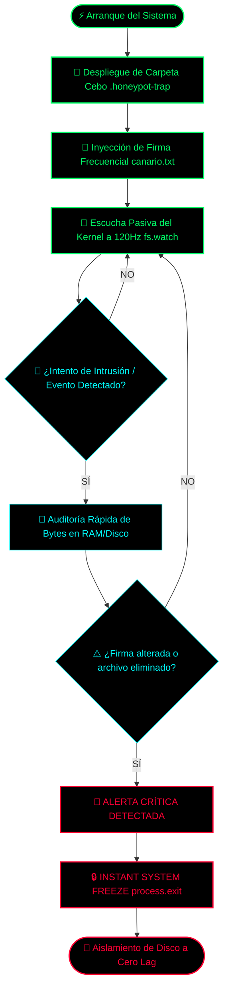

# Anti-Ransomware Canary Centinel 🛡️

A low-latency behavioral anti-ransomware suite built in Node.js. This repository provides dual-environment implementation architecture to monitor file system structures and enforce immediate process mitigation upon unauthorized cryptographic alterations.

## 🗂️ Environment Architecture (How to run the scripts)

The suite is divided into two operational environments depending on your target hardware deployment:

### 🟢 1. Production Environment (Real PC / Server)
* **File:** `canario-prod.js`
* **Target Hardware:** Desktop Computers, Laptops, and Enterprise Servers running Windows, Linux, or macOS with active local storage access.
* **Operational Flow:** Deploys physical honeypot directories directly into the file system. It leverages native Node.js core modules (`fs`) to monitor hardware storage in cold isolation.
* **Execution Command:**
  ```bash
  node canario-prod.js
  ```

### 📱 2. Live Simulation Environment (Mobile App / Virtual Engine)
* **File:** `canario.js`
* **Target Hardware:** Mobile devices, tablets, and sandboxed in-app console environments (such as Acode internal engines).
* **Operational Flow:** Virtualizes the behavioral detection loop strictly inside the volatile RAM buffer via global runtime engines (`globalThis`), avoiding environment crashes or file system sandbox restrictions.
* **Execution Flow:** Run the script in your in-app console. To simulate an active ransomware infection vector, execute:
  ```javascript
  simularAtaqueRansomware()
  ```

---
*Disclaimer: Developed for behavioral defense assessment and advanced threat analysis.*



